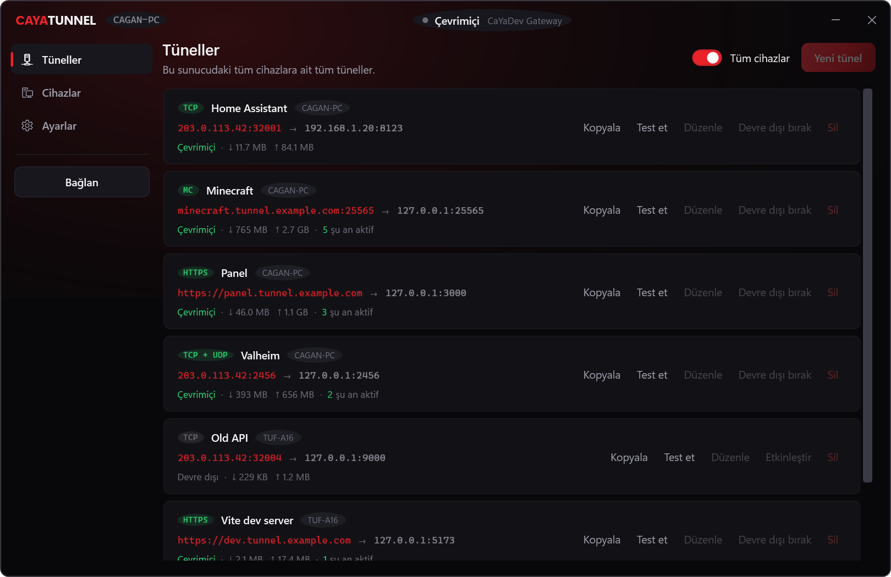
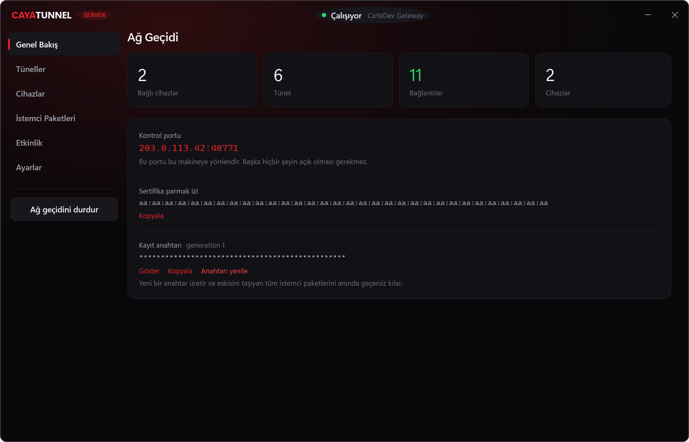
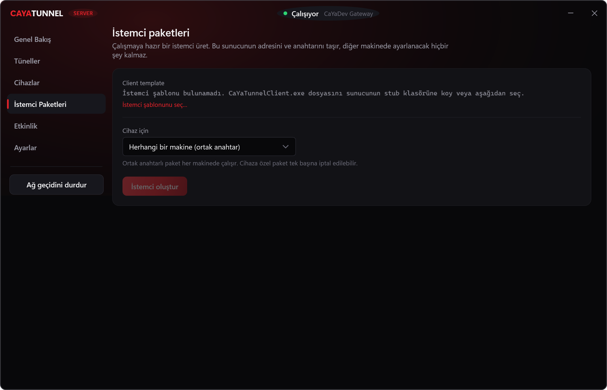
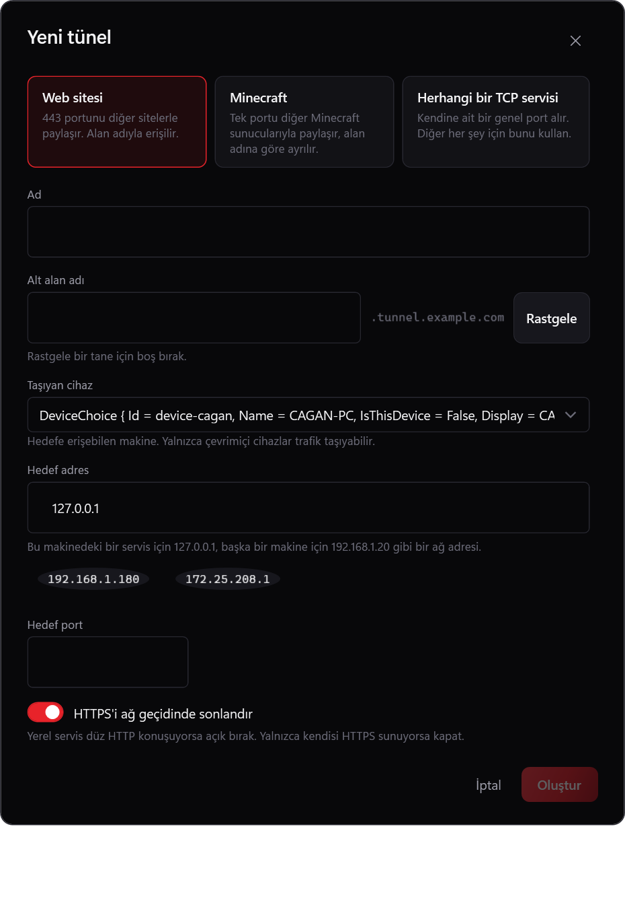

# CaYaTunnel

Self-hosted reverse tunnels for services behind NAT, CGNAT, or a router you cannot
forward ports on. Run the gateway on a VPS, run the agent on the machines that hold
your services, and reach them from the internet — without opening a single port at
home.

Two Windows applications, one protocol:

- **CaYaTunnel Server** — the gateway. Owns the public addresses, the device registry,
  DNS automation, and the client builds.
- **CaYaTunnel Client** — the agent. A single portable executable that dials out to the
  gateway and forwards traffic to services on its own machine or anywhere on its LAN.



---

## Why it works without port forwarding

The gateway never dials your machine. The agent opens an outbound TLS connection to the
gateway and keeps it alive — the same kind of connection a browser makes, which every
router allows by default. Public traffic then rides back down that already-open link.

```
              Internet
                 │
                 ▼
      ┌──────────────────────┐
      │   CaYaTunnel Server  │   one port forwarded here, on your VPS
      └──────────┬───────────┘
                 │  outbound TLS, opened by the client
                 │  (multiplexed: control + N data streams)
        ┌────────┴────────┐
        ▼                 ▼
    CAGAN-PC           TUF-A16
        │                 │
   127.0.0.1:25565   127.0.0.1:5173
   192.168.1.20:8123
```

Only the gateway needs an open port. Nothing is forwarded on the client side, ever.

---

## What a tunnel can be

The three kinds exist because they are genuinely different routing problems, not because
of a preference:

| Kind | Public address | How traffic is matched |
|---|---|---|
| **Website** | `https://panel.tunnel.example.com` | Shares 80/443 with every other site; split by TLS SNI or the HTTP `Host` header |
| **Minecraft** | `mc.tunnel.example.com:25565` | Shares one port with other Minecraft servers; split by the address inside the Java handshake |
| **Port forward** | `203.0.113.42:32001` | Gets a public port of its own, carrying **TCP, UDP, or both** |

Most protocols announce no hostname, which is exactly why the third kind exists and gets
a port to itself.

**UDP** rides the same link with datagram boundaries preserved, and each visitor address
becomes its own flow. Because the link underneath is reliable, packet loss on a bad
connection costs latency rather than dropped datagrams — usually what you want for a game
server, but worth knowing.

**Website tunnels** choose their scheme: both HTTP and HTTPS, HTTPS only, HTTP only, or a
permanent redirect from HTTP to HTTPS.

---

## Getting started

Download from [Releases](https://github.com/CaYatur/CaYaTunnel/releases):

- **`CaYaTunnel-Server-win-x64.zip`** — the gateway. Unpack it on your VPS. The client
  template is already inside, so client builds work the moment you unpack.
- **`CaYaTunnelClient.exe`** — a plain client, for setting one up by hand. You normally do
  not need this: the gateway builds configured clients for you.

### 1. The gateway, on your VPS

Windows Server 2019 or newer; Windows 10/11 works too. The release archive is
self-contained, so no runtime install is needed.

1. Run `CaYaTunnelServer.exe`.
2. Open **Settings** and fill in:
   - **Public host** — your VPS's public IP, or a hostname pointing at it.
   - **Base domain** — e.g. `tunnel.example.com`. Leave empty for an IP-and-port-only
     deployment; hostname tunnels are then hidden rather than broken.
   - **Control port** — defaults to `48771`. This is the only port that must reach the
     machine from the internet.
3. Forward the control port to the VPS, plus whichever public ports you intend to use
   (80/443 for websites, 25565 for Minecraft, and the TCP/UDP tunnel range).
4. Press **Start gateway**.



### 2. A client build

Open **Client builds**, pick a device (or "any machine"), and press **Build client**.

You get one executable that already knows the gateway's address, its certificate
fingerprint, and its key. Copy it to the target machine and run it — there is nothing to
configure and nothing to install.



### 3. Publish something

On the client, press **New tunnel**, choose what kind of service it is, and point it at a
local or LAN address.



Every device sees every tunnel, live. Create one on your desktop and it appears on your
laptop immediately — the control channel is already open, so there is nothing to poll.
Delete someone else's tunnel and the machine that owned it says so.

---

## How many ports do I actually have to open?

**On every client machine: none.** Not one, ever. The agent dials out; nothing dials in. This
is the whole point and there is no configuration that changes it.

**On the gateway**, it depends on what you serve:

| What you run | Ports the gateway needs |
|---|---|
| Websites and/or Minecraft only | **One.** Turn on *Share one port for everything possible* |
| Websites on the standard 80/443 | Three: control, 80, 443 |
| Anything with its own public port (game servers, SSH, databases) | One per tunnel, plus the above |

### Single-port mode

Agent links, websites and Minecraft can all arrive on the control port, because each announces
where it is going in its first bytes — the agent by its TLS server name, a website by SNI or the
`Host` header, Minecraft by its handshake. The gateway reads that and hands the connection to the
right place.

Turn it on in **Settings → Listeners**. Forward that one port and you are done.

The trade: visitors reach websites on that port (`https://panel.example.com:48771`) rather than
on 443, unless something in front maps it for you — Cloudflare's proxy can, and so can any load
balancer. If you want bare `https://panel.example.com`, use 443.

### Why port tunnels still need their own port

A plain TCP or UDP protocol carries no destination. A database client and a game client both open
a socket and start talking, with nothing in the bytes to say which tunnel they meant. The port
number has to *be* the destination — so each one needs its own, and no amount of cleverness
removes that. Anything claiming otherwise is guessing.

### Firewall rules

**Settings → Windows Firewall** lists exactly which ports your current configuration needs and
creates inbound rules for them. Rules are tagged as CaYaTunnel's, so removing them never touches
anything else. Needs administrator rights.

---

## Is it actually working?

Every tunnel has a **Test** button in the client. It tries the tunnel rather than reporting what
the configuration says, and answers in the order you would debug it:

1. **Is the local service up?** Dialled directly on the machine carrying the tunnel. If this
   fails, the tunnel is fine and the service is not — and the test stops there rather than
   blaming the tunnel for it.
2. **Is the public address reachable?** Connected from outside the tunnel.
3. **Did traffic actually land here?** For websites, a real request goes through and the answer
   is checked. Reaching the gateway is not the same as reaching your tunnel: an unrouted hostname
   still completes a TCP connection and then answers with the gateway's own 404.

A UDP-only tunnel can only be checked as far as step 1 and 2's address resolution. UDP has no
handshake, so silence is indistinguishable from a working service with nothing to say — the test
says that rather than inventing a green tick.

---

## DNS

Hostname tunnels need DNS pointing at the gateway. Two ways:

- **Manual** — create one wildcard record yourself: `*.tunnel.example.com → 203.0.113.42`.
  Nothing else to do; every tunnel you create is covered.
- **Cloudflare** — paste an API token with `Zone / DNS / Edit` on that zone and records are
  created and removed with the tunnels.

The token is stored encrypted with DPAPI and never leaves the machine.

If you proxy website records through Cloudflare, note that TCP and Minecraft tunnels are
always left unproxied regardless of that setting. An HTTP proxy will happily accept a
Minecraft connection and then fail to carry it, which produces a hostname that resolves
but never connects — so the gateway does not let you configure that mistake.

---

## Security model

- **Outbound only.** No inbound port on any client machine.
- **Pinned certificates.** A provisioned client carries the SHA-256 of the gateway's
  certificate and refuses anything else. This is stricter than public CA validation and
  needs no certificate authority, no renewal, and no domain.
- **Two kinds of key.** A build for a named device carries its own key, so revoking that
  device disables that build alone. A build for "any machine" carries the shared key.
- **One kill switch.** Rotating the enrollment key invalidates every build carrying the old
  one, immediately, on their next connect. A refused client is told *why* — "the key was
  rotated" reads very differently from "bad key" when you are trying to work out what
  happened.
- **Optional approval.** New devices can be held until an operator approves them, even with
  a valid key.

**Provisioned clients are unsigned.** The gateway appends configuration to the tail of a
prebuilt executable, which is what lets it hand out ready-to-run clients with no compiler
on the VPS — and appending bytes invalidates an Authenticode signature. SmartScreen may
warn on first run. This is an accepted trade for a self-hosted tool where you build your
own clients.

---

## Running unattended

Both applications can start with Windows, and either can be elevated. Startup uses the
`Run` key normally, or a scheduled task when you ask for administrator rights — Windows
offers no single mechanism that covers both.

The gateway can also install itself as a **Windows service**, which keeps tunnels up with
nobody signed in. The service runs the same binary and the same code the admin app drives,
so the two cannot drift.

Both applications live in the tray. Closing the window does not stop them — the agent keeps its
tunnels up and the gateway keeps serving them — and **Exit** in the tray menu quits for real.
Launching either a second time brings the running window forward rather than starting a second
copy, which would only fight the first over the same ports or the same device identity.

The client starts hidden if you want, and reconnects on its own with exponential backoff. A brief
network drop does not need a restart:

```
Disconnected → Reconnecting → Authenticated → Tunnels restored → Online
```

---

## Nothing is hard-coded

No domain, host, port, or provider appears in the source. `cayadev.com` is one
deployment's configuration, not a constant. Clone this, point it at `example.net`, and
nothing needs editing but the settings screen.

---

## Building from source

Requires the [.NET 10 SDK](https://dotnet.microsoft.com/download/dotnet/10.0).

```bash
dotnet build CaYaTunnel.slnx
dotnet test tests/CaYaTunnel.Core.Tests/CaYaTunnel.Core.Tests.csproj
```

The client stub — the executable the gateway copies when provisioning — is a single-file
self-contained publish:

```bash
dotnet publish src/CaYaTunnel.Client.App -c Release -o artifacts/client
```

Put the result next to `CaYaTunnelServer.exe`, or point at it from **Client builds →
Choose client template**. The release archive already contains it; you only need this when
building from source.

> The single-file publish settings in `CaYaTunnel.Client.App.csproj` are load-bearing.
> Provisioning appends a configuration blob to the executable's tail, so a change that
> alters the bundle layout — compression in particular — breaks it.

### Layout

```
src/
  CaYaTunnel.Core         protocol, framing, models, provisioning blob
  CaYaTunnel.Server       gateway engine: listeners, registry, routing, DNS
  CaYaTunnel.Server.App   admin window and Windows service host
  CaYaTunnel.Client       agent engine: link, reconnect, local dialling
  CaYaTunnel.Client.App   client window and tray
shared/                   theme, MVVM, localisation, Windows integration
tests/                    protocol, sniffers, and live gateway integration tests
```

Both applications render their own screenshots, which is how the images above are made
and how layout changes get checked:

```bash
dotnet run --project src/CaYaTunnel.Client.App -- --capture docs/images
```

---

## Roadmap

Built to extend rather than to be rewritten: IPv6, multiple gateway nodes, load balancing,
relay nodes, bandwidth limits, per-tunnel access control, more DNS providers, Linux and
macOS agents, and server clustering.

## Licence

MIT. See [LICENSE](LICENSE).
